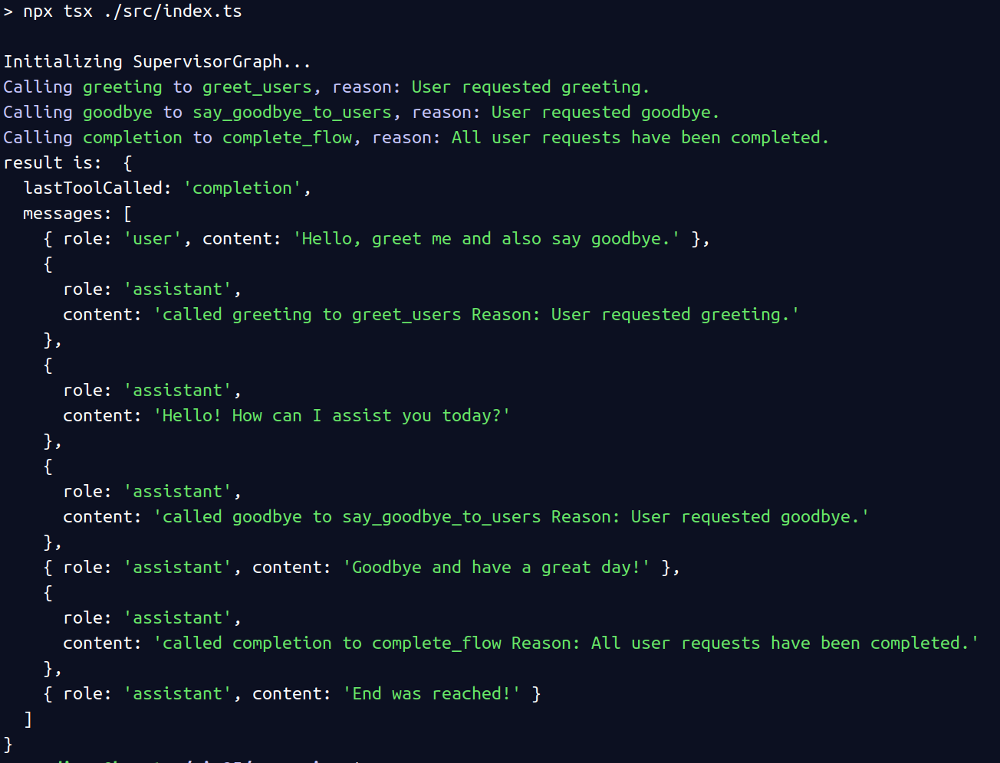
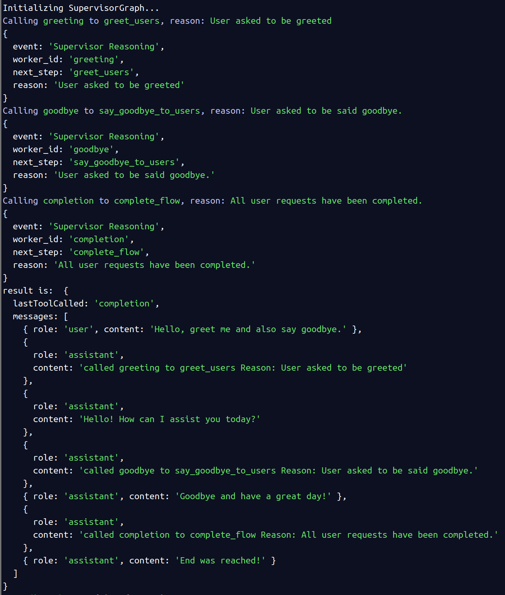

## Screenshots

### Full flow first iteration

### Full flow second iteration with last step stored in result

### Full flow third iteration with reasoning logs and reasoning output based on config
**Reasoning output, only logging to console/logs**

**Reasoning output, logging reasoning output json. JSON could be sent to client (Chat UI), API or other external source via API or event, webhook, etc..**

