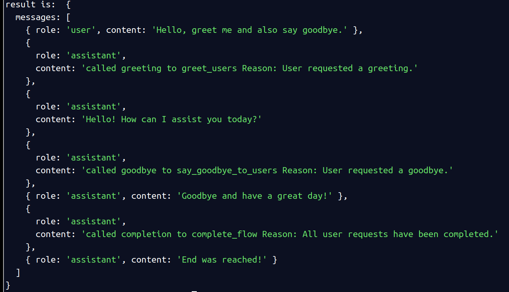
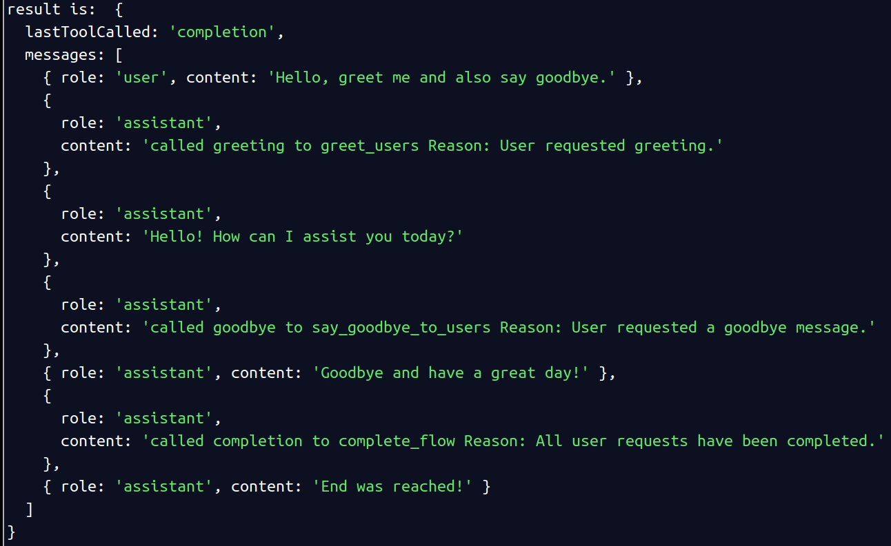
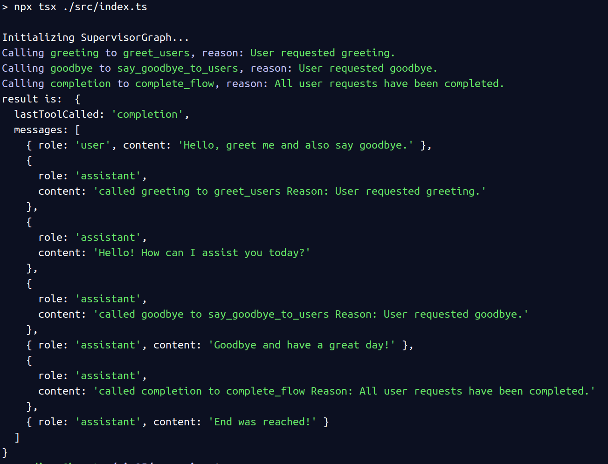
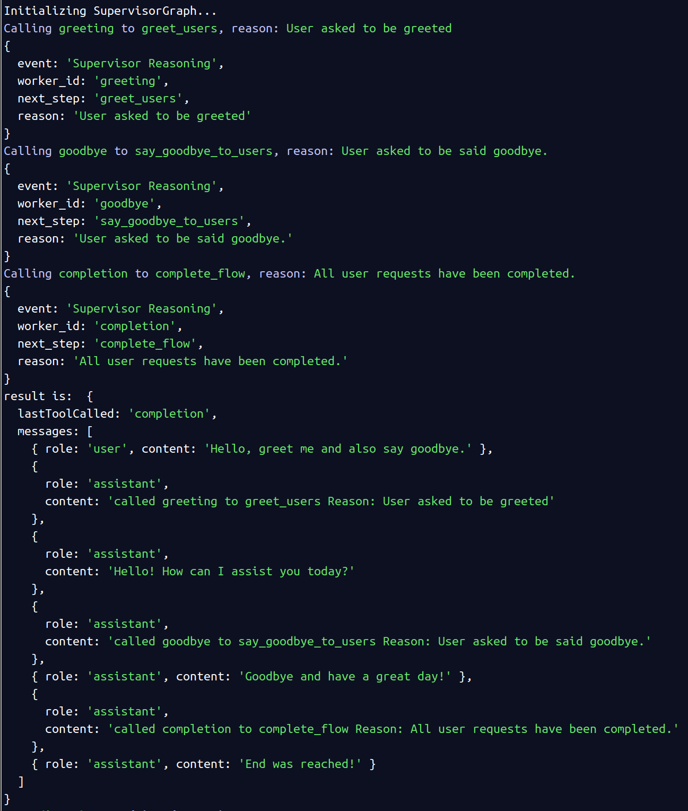
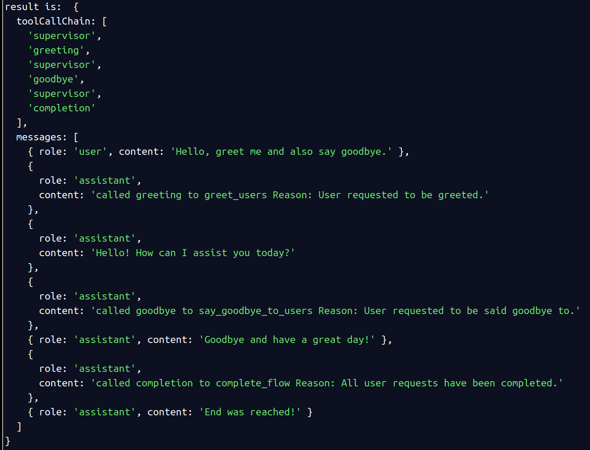
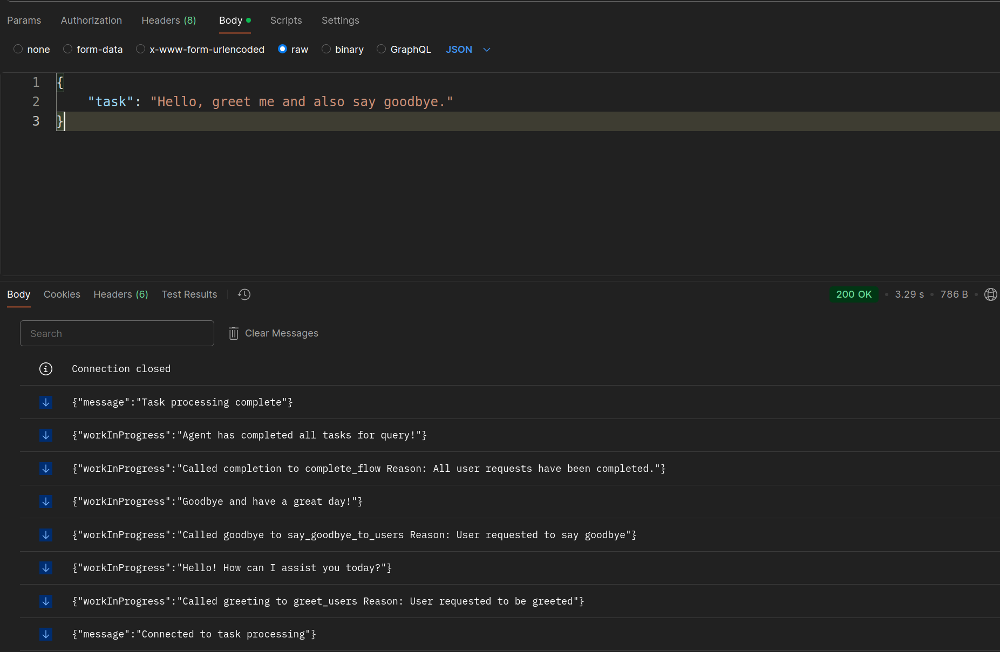

## Screenshots

### 1st iteration
**First full flow**

### 2nd iteration
**Last step stored in result**

### 3rd iteration
**Reasoning logs and reasoning output based on config**

**Reasoning output, only logging to console/logs**

**Reasoning output, logging reasoning output json. JSON could be sent to client (Chat UI), API or other external source via API or event, webhook, etc..**

## 4th iteration
**Adding toolchain history to graph state**

## 5th iteration
- **Added Express server with server side events as a second mechanism to run graph**
- **Updated invoke to stream in order to access the graph state after each node completion**

